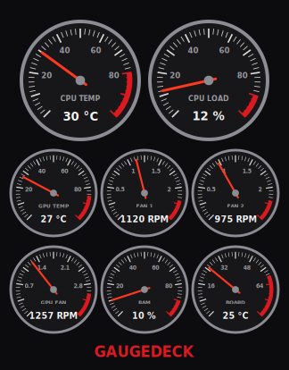

# GaugeDeck

https://github.com/Cyoulater/gaugedeck

Car-style dashboard gauges for your Linux PC: CPU temp, CPU load, GPU temp,
fan speeds, RAM use, and board temp.

Built as a native GTK 4 / Wayland app, so it works on current GNOME desktops
(Ubuntu 25.10 / 26.04 and later) where desktop widgets like Conky freeze or
fail to draw.

## Install
    sh install.sh                # or: sh install.sh "MY RIG NAME"   (sets the title shown under the gauges)
Then open **GaugeDeck** from your app menu. Right-click it in the dock
and choose "Pin to Dash" to keep it there. Close it with the X.

## Settings
Edit `~/.config/gaugedeck/config`:

    title=MY RIG
    scale=0.6      # 0.3 = tiny, 1.0 = large

## Alerts
GaugeDeck warns you when something is wrong: a desktop notification, an alarm
sound, and the gauge flashes red. It alerts once when a reading stays in the
red for 5 seconds (quick spikes are ignored), and again when it's back to normal.

It also warns if a fan that was spinning stops (0 RPM).

Test it:  `gaugedeck --test-alert` (pop-up, alarm, and the CPU TEMP gauge flashes for 10 seconds)

Alerts only run while GaugeDeck is open (minimize it instead of closing it).
Change the limits in `~/.config/gaugedeck/config`:

    alerts=on
    alert_sound=on
    alert_seconds=5
    cpu_temp_alert=80
    gpu_temp_alert=85
    board_temp_alert=60
    ram_alert=95
    fan_stop_alert=on
    nv_temp_alert=85

## NVIDIA compute cards
If the machine has an NVIDIA card (like a Tesla P100) alongside an AMD or Intel
display card, GaugeDeck adds a bottom row with that card's temperature and
power draw (read from `nvidia-smi`). The temperature alerts at `nv_temp_alert`.

## Sensors
Detected automatically at startup:
- CPU: Intel (coretemp) or AMD (k10temp / zenpower)
- GPU: AMD (amdgpu/radeon), Intel, nouveau, or NVIDIA via nvidia-smi
- Board temp and fans: Nuvoton, ITE, Fintek, Winbond, ASUS, Gigabyte, Dell, ThinkPad, HP
  (fan gauges show the first two fan headers that are actually spinning)

A gauge shows `--` if that sensor isn't available. For board sensors, run
`sudo sensors-detect` once (package `lm-sensors`).

Read-only: the app only reads from /sys and /proc. It changes nothing.

## Uninstall
    sh uninstall.sh

## License
GPL-3.0-or-later. Free to use, share, and modify. If you share a changed
version, you must share its source code under the same license. See LICENSE.
